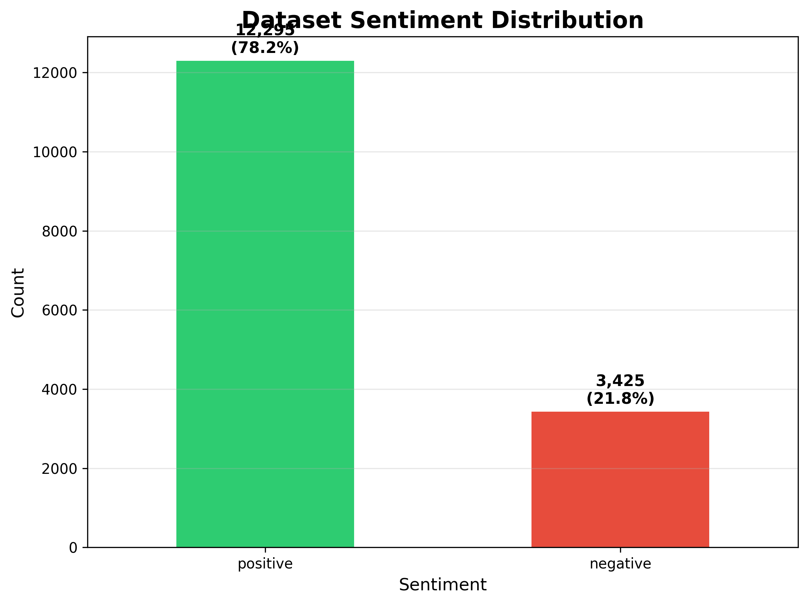
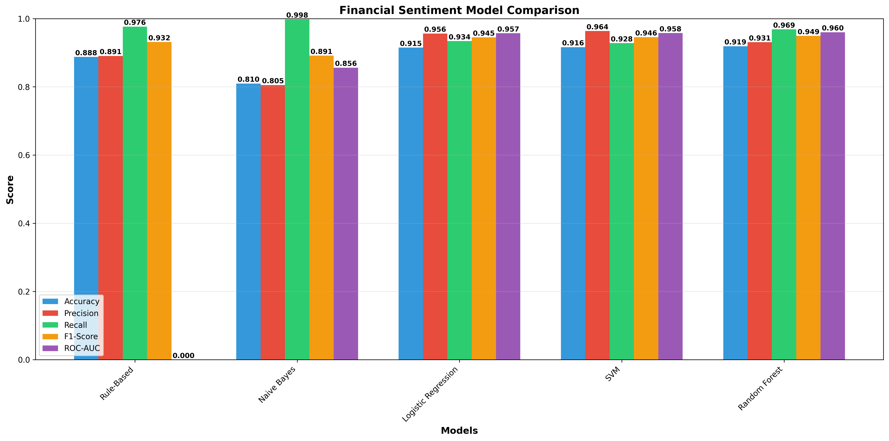
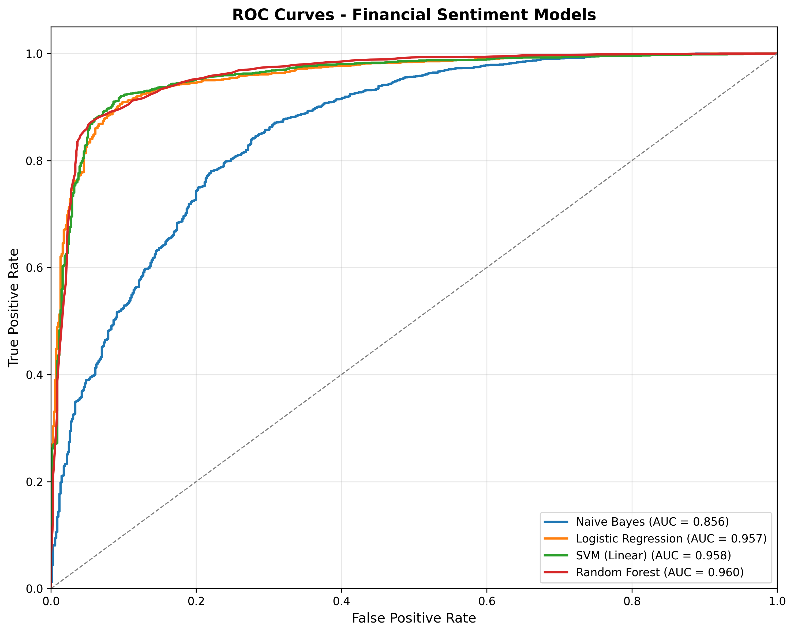
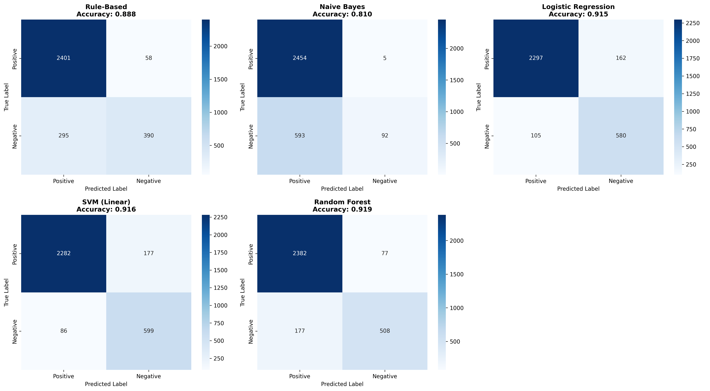
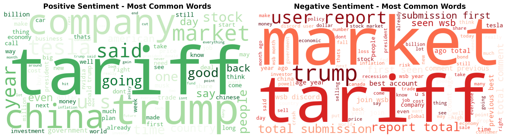

# 📈 Financial Sentiment Analysis — Reddit NLP Project

A machine learning project that classifies financial sentiment (bullish vs bearish) from Reddit posts. Five different classification approaches are compared, ranging from a simple rule-based system to ensemble learning with Random Forest.

---

## 📂 Dataset

The dataset is **custom-built** from Reddit financial communities, containing **15,720 posts** labelled as either positive (bullish) or negative (bearish) sentiment.

Labels were assigned using an automated keyword-based system before being used to train and evaluate supervised ML models.

### Sentiment Distribution



The dataset is imbalanced — **78.2% positive** (12,295 posts) and **21.8% negative** (3,425 posts). All ML models were configured with `class_weight='balanced'` to compensate for this.

---

## 🧠 Models

Five classifiers were implemented and evaluated:

| Model | Description |
|---|---|
| **Rule-Based** | Keyword matching — 11 bullish and 11 bearish terms |
| **Naive Bayes** | Probabilistic classifier using Bayes' theorem with TF-IDF features |
| **Logistic Regression** | Linear model with sigmoid output; `max_iter=1000`, balanced class weights |
| **SVM (Linear)** | Finds the optimal separating hyperplane in TF-IDF feature space |
| **Random Forest** | Ensemble of 100 decision trees with bootstrap aggregation |

All models used `random_state=42` for reproducibility. TF-IDF vectorisation was used for feature extraction across all ML models.

---

## 📊 Results

### Overall Performance



| Model | Accuracy | Precision | Recall | F1-Score | ROC-AUC |
|---|---|---|---|---|---|
| Rule-Based | 0.888 | 0.891 | 0.976 | 0.932 | N/A |
| Naive Bayes | 0.810 | 0.805 | 0.998 | 0.891 | 0.856 |
| Logistic Regression | 0.915 | 0.956 | 0.934 | 0.945 | 0.957 |
| SVM (Linear) | 0.916 | 0.964 | 0.928 | 0.946 | 0.958 |
| **Random Forest** | **0.919** | **0.931** | **0.969** | **0.949** | **0.960** |

**Random Forest** came out on top across every key metric. Its ensemble of 100 decision trees was best at balancing precision and recall, achieving a 0.949 F1-score and 0.960 ROC-AUC.

**Naive Bayes** showed an interesting extreme — nearly perfect recall (99.8%) but at the cost of precision (80.5%), producing 593 false positives. It essentially predicts positive sentiment almost all the time.

**SVM and Logistic Regression** performed almost identically (as expected for linear classifiers on TF-IDF data), both landing around 91.5–91.6% accuracy with well-balanced precision-recall trade-offs.

The **Rule-Based baseline** held up surprisingly well at 88.8% accuracy given its simplicity, but struggled to identify negative sentiment — only 57% negative recall vs 97.6% positive recall.

---

### ROC Curves



The ROC curves make the performance gap between Naive Bayes and the other three ML models very clear. Logistic Regression, SVM, and Random Forest all cluster tightly together near the top-left corner, showing strong discriminative ability.

---

### Confusion Matrices



The confusion matrices reveal how each model handles the class imbalance:

- **Naive Bayes** classifies almost everything as positive — only 92 out of 685 negative instances are correctly identified (13.4% negative recall).
- **SVM** is the best at catching negative sentiment, correctly identifying 599/685 bearish posts (87.4% negative recall).
- **Random Forest** correctly classifies 2,382/2,459 positive instances and 508/685 negative instances.

---

## 🔤 Word Clouds



Looking at the most common words in each class reveals some interesting differences in how users express sentiment:

- **Positive posts** are dominated by general market terms like *company*, *market*, *stock*, and *tariff*, with forward-looking language like *going*, *good*, and *think*.
- **Negative posts** share some of the same terms but lean heavily on fear-related vocabulary: *recession*, *inflation*, *risk*, *loss*, *sell*, and *crash*. The presence of *wsb* (WallStreetBets), *submission*, and *report* also suggests bearish investors tend to adopt a more analytical, data-referencing tone.

---

## ⚠️ Limitations

- **Class imbalance** (78.2% / 21.8%) meant negative recall was consistently 10–25% lower than positive recall across all models, even with class weighting.
- **Keyword labelling** is imperfect — sarcasm, implied meaning, and phrases like "taking profits" can be mislabelled.
- **Platform-specific language** (e.g. Reddit slang like "diamond hands", "tendies") may not transfer well to formal financial news sources.
- The dataset reflects **2024–2025 market conditions**, so model performance may degrade over time as financial language evolves.

---

## 🔮 Future Work

- Manual annotation by domain experts for higher-quality ground truth labels
- Fine-tuned transformer models like **FinBERT** or **BiLSTM with attention** (estimated 93–95% accuracy)
- **SMOTE** or ensemble resampling to better handle class imbalance and improve negative class recall
- Multi-platform expansion to Twitter, Bloomberg, and Reuters for better generalisability
- **Aspect-based sentiment analysis** to detect entity-level sentiment (e.g. "bullish on $AAPL but bearish on $TSLA")

---

## 🛠️ Tech Stack

- Python 3
- scikit-learn
- NLTK / spaCy
- pandas, numpy
- matplotlib, seaborn
- WordCloud

---

## 📁 Repository Structure

```
├── data/
│   └── reddit_financial_sentiment.csv   # Custom dataset
├── notebooks/
│   └── sentiment_analysis.ipynb         # Main analysis notebook
├── figures/
│   ├── model_comparison_final.png
│   ├── confusion_matrices.png
│   ├── roc_auc_curves.png
│   ├── sentiment_distribution.png
│   └── wordclouds.png
└── README.md
```

---

## 📜 License

This project and its custom dataset are for academic and research purposes.
